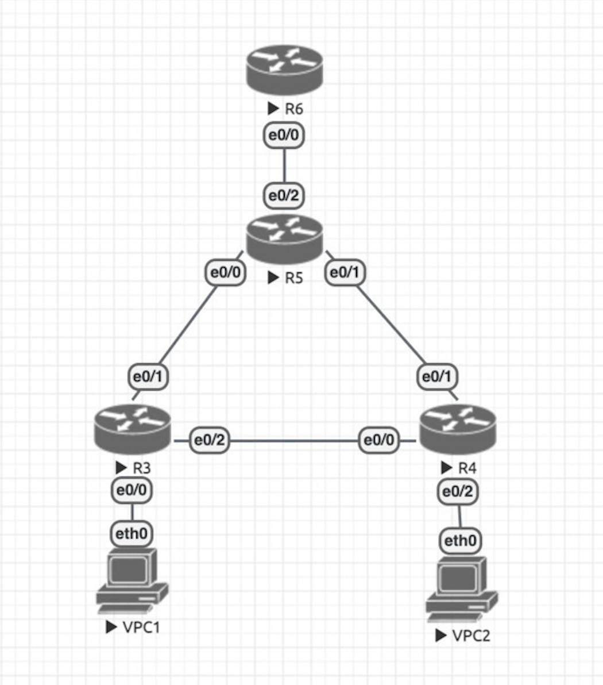

Топология:



Коммутаторы уровня доступа - cfg3, cfg4, cfg5
----
S3:
```
config terminal
(config)#vlan 10
(config-vlan)#exit
(config)#vlan 20
(config-vlan)#exit
(config)#interface e0/0
(config-if)#switchport mode access
(config-if)#switchport access vlan 10
(config-if)#exit
(config)#interface e0/1
(config-if)#switchport trunk encapsulation dot1q
(config-if)#switchport trunk allowed vlan 10,20
(config-if)#switchport mode trunk
(config-if)#exit
(config)#interface e0/2
(config-if)#switchport trunk encapsulation dot1q
(config-if)#switchport trunk allowed vlan 10,20
(config-if)#switchport mode trunk
(config-if)#exit
(config)#vtp mode transparent
(config)#exit
write
```
---
S4:

```
config terminal
(config)#vlan 10
(config-vlan)#exit
(config)#vlan 20
(config-vlan)#exit
(config)#interface e0/1
(config-if)#switchport mode access
(config-if)#switchport access vlan 10
(config-if)#exit
(config)#interface e0/0
(config-if)#switchport trunk encapsulation dot1q
(config-if)#switchport trunk allowed vlan 10,20
(config-if)#switchport mode trunk
(config-if)#exit
(config)#interface e0/2
(config-if)#switchport trunk encapsulation dot1q
(config-if)#switchport trunk allowed vlan 10,20
(config-if)#switchport mode trunk
(config-if)#exit
(config)#vtp mode transparent
(config)#exit
write
```
----
S5:
```
config terminal
(config)#vlan 10
(config-vlan)#exit
(config)#vlan 20
(config-vlan)#exit
(config)#interface e0/1
(config-if)#switchport trunk encapsulation dot1q
(config-if)#switchport trunk allowed vlan 10,20
(config-if)#switchport mode trunk
(config-if)#exit
(config)#interface e0/0
(config-if)#switchport trunk encapsulation dot1q
(config-if)#switchport trunk allowed vlan 10,20
(config-if)#switchport mode trunk
(config-if)#exit
(config)#interface e0/2
(config-if)#switchport trunk encapsulation dot1q
(config-if)#switchport trunk allowed vlan 10,20
(config-if)#switchport mode trunk
(config-if)#exit
(config)#spanning-tree vlan 1 root primary
(config)#spanning-tree vlan 10 root primary
(config)#spanning-tree vlan 20 root primary
(config)#vtp mode transparent
(config)#exit
write
```

-----

Маршрутизатор R - cfg6
---
```
config terminal
(config)#interface e0/0
(config-if)#no shutdown
(config-if)#exit
(config)#interface e0/0
(config)#interface e0/0.10
(config-subif)#encapsulation dot1Q 10
(config-subif)#ip address 10.0.10.1 255.255.255.0
(config-subif)#exit
(config)#interface e0/0.20
(config-subif)#encapsulation dot1Q 20
(config-subif)#ip address 10.0.20.1 255.255.255.0
(config-subif)#exit
(config)#exit
write
```

----

Клиент VPC1 - cfg1

```
ip 10.0.10.2 255.255.255.0 10.0.10.1
```
-----

Клиент VPC2 - cfg2

```
ip 10.0.20.2 255.255.255.0 10.0.20.1
```
----
